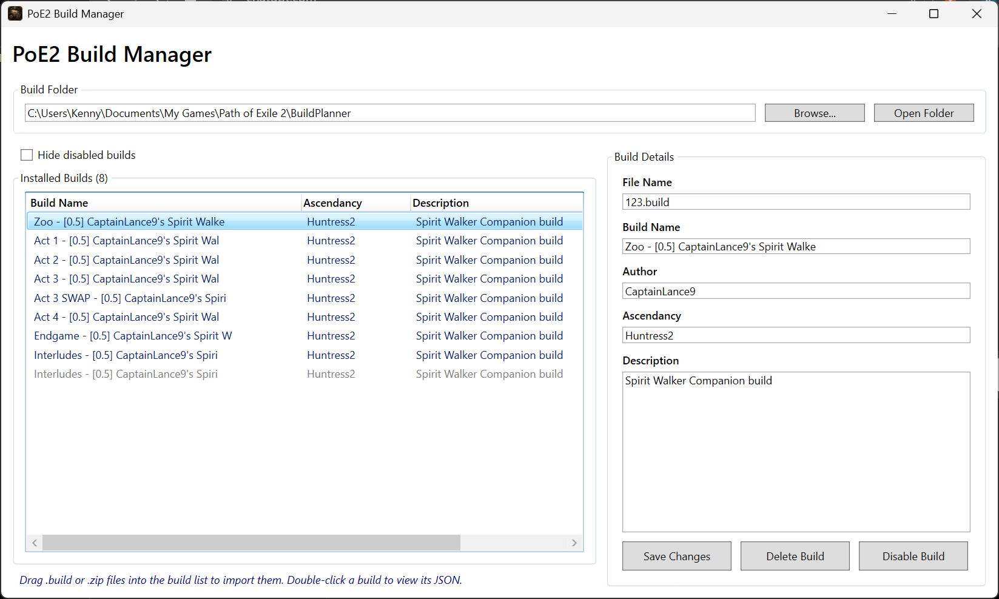

# PoE2 Build Manager

A desktop application for managing Path of Exile 2 build files.

## Features

- Import .build files
- Import .zip files
- Edit metadata
- Enable/disable builds
- JSON viewer
- Folder selection

## Tech Stack

- .NET 9
- WPF
- CommunityToolkit.Mvvm
- AvalonEdit

## Screenshots

